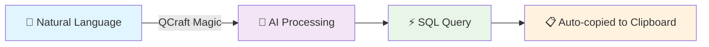
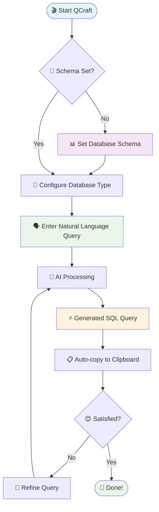
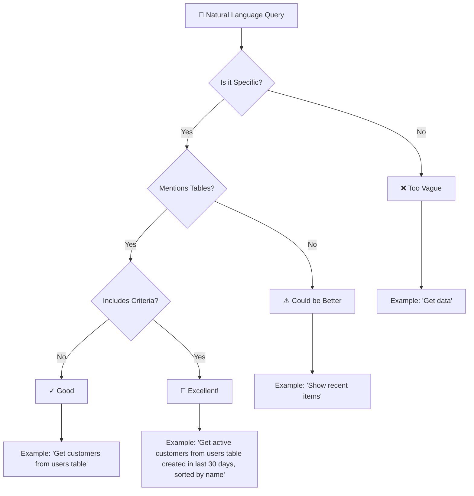
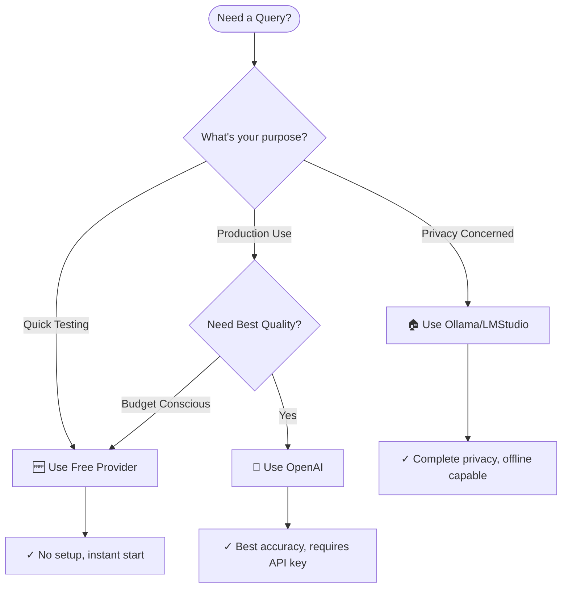

# 🚀 QUERY-CRAFTER-CLI (QCraft)

<div align="center">

```
 ██████╗ ██╗   ██╗███████╗██████╗ ██╗   ██╗      ██████╗██████╗  █████╗ ███████╗████████╗███████╗██████╗       ██████╗██╗     ██╗
██╔═══██╗██║   ██║██╔════╝██╔══██╗╚██╗ ██╔╝     ██╔════╝██╔══██╗██╔══██╗██╔════╝╚══██╔══╝██╔════╝██╔══██╗     ██╔════╝██║     ██║
██║   ██║██║   ██║█████╗  ██████╔╝ ╚████╔╝      ██║     ██████╔╝███████║█████╗     ██║   █████╗  ██████╔╝     ██║     ██║     ██║
██║▄▄ ██║██║   ██║██╔══╝  ██╔══██╗  ╚██╔╝       ██║     ██╔══██╗██╔══██║██╔══╝     ██║   ██╔══╝  ██╔══██╗     ██║     ██║     ██║
╚██████╔╝╚██████╔╝███████╗██║  ██║   ██║        ╚██████╗██║  ██║██║  ██║██║        ██║   ███████╗██║  ██║     ╚██████╗███████╗██║
 ╚══▀▀═╝  ╚═════╝ ╚══════╝╚═╝  ╚═╝   ╚═╝         ╚═════╝╚═╝  ╚═╝╚═╝  ╚═╝╚═╝        ╚═╝   ╚══════╝╚═╝  ╚═╝      ╚═════╝╚══════╝╚═╝
```

**🎯 Convert Natural Language to SQL or nay database query with AI Power**


*Transform your thoughts into database queries instantly*

</div>

---

## 🌟 What is QCraft?

QCraft is a revolutionary command-line interface that bridges the gap between human language and database queries. Whether you're a developer, data analyst, or database administrator, QCraft empowers you to generate complex SQL, NoSQL, and other database queries using natural language.



## 🎬 See QCraft in Action

```bash

# get your schema form databse, as schema.sql or just put any king of schem in a file like main_scehma01.txt
# somple use this file to share sceham to the cli tool

$ qcraft method --extract "main_schema01.txt"


# Set your database schema
$ qcraft method --paste "CREATE TABLE orders (id INT, customer_name VARCHAR(100), amount DECIMAL(10,2), order_date DATE)"

# Configure your database type
$ qcraft query-type PostgreSQL

# Convert natural language to SQL
$ qcraft convert "Show me all orders above $500 from last month" --provider free
```

**Result:**
```sql
SELECT * FROM orders 
WHERE amount > 500 
  AND order_date >= DATE_TRUNC('month', CURRENT_DATE - INTERVAL '1 month')
  AND order_date < DATE_TRUNC('month', CURRENT_DATE);
```

## 🚀 Quick Start

### Installation

```bash
npm install -g qcraft-cli
```

### 30-Second Setup

```bash
# 1. Set your database schema
qcraft method --paste "YOUR_DATABASE_SCHEMA"
# or if schema file availabel just auto extract it
$ qcraft method --extract "main_schema01.txt"

# 2. Choose your database type
qcraft query-type "PostgreSQL"

# 3. Start converting!
qcraft convert "Get all users who signed up this week" --provider free
```

## 🔥 Key Features

<div align="center">

| Feature | Description | Status |
|---------|-------------|--------|
| 🗣️ **Natural Language Processing** | Convert plain English to SQL | ✅ |
| 🎯 **Multi-Database Support** | PostgreSQL, MySQL, MongoDB, SQLite & more | ✅ |
| 🤖 **Multiple AI Providers** | OpenAI, Ollama, LMStudio, Free tier | ✅ |
| 📋 **Auto-Clipboard** | Generated queries copied automatically | ✅ |
| 🔄 **Query Refinement** | Retry and improve queries easily | ✅ |
| 💡 **Smart Explanations** | Understand what your queries do | ✅ |
| ⚙️ **Configuration Management** | Save settings for seamless workflow | ✅ |
| 🎨 **Beautiful CLI Interface** | Intuitive and visually appealing | ✅ |

</div>

## 🔄 How QCraft Works



## 🛠️ Command Reference

### 📊 Schema Management

```bash
# Paste schema directly
qcraft method --paste "CREATE TABLE users (id INT, name VARCHAR(50), email VARCHAR(100))"

# Extract schema from file
qcraft method --extract schema.sql
```

### 🔧 Database Configuration

```bash
# Set database type
qcraft query-type "PostgreSQL"
qcraft query-type "MongoDB" 
qcraft query-type "MySQL"
```

### 🚀 Query Conversion

```bash
# Basic conversion with free provider
qcraft convert "Find all active users" --provider free

# Use OpenAI with specific model
qcraft convert "Get top 10 customers by revenue" --provider openai --model gpt-4o-mini

# Use local Ollama
qcraft convert "Show recent orders" --provider ollama --model llama2
```

### 🛠️ Query Assistance

```bash
# Retry with improvements
qcraft assist retry "add ORDER BY date DESC" --provider free

# Get detailed explanation
qcraft assist explain --provider openai
```

### ⚙️ Configuration Management

```bash
# Set configuration values
qcraft config set DEFAULT_PROVIDER openai
qcraft config set API_KEY sk-your-api-key-here

# View current settings
qcraft config get SCHEMA
qcraft config list

# Clear all settings
qcraft config flush
```

## 🤖 AI Provider Options

<div align="center">

### Choose Your AI Power

| Provider | Cost | Setup Required | Best For | Models Available |
|----------|------|----------------|----------|------------------|
| **🆓 Free** | Free | None | Quick testing, learning | Built-in model |
| **🧠 OpenAI** | Paid | API key | Best quality, complex queries | GPT-4, GPT-3.5-turbo |
| **🏠 Ollama** | Free | Local install | Privacy, offline use | Llama2, Mistral, CodeLlama |
| **🖥️ LMStudio** | Free | Local install | GUI management | Various local models |

</div>

### Setting Up Providers

<details>
<summary>🔧 OpenAI Setup</summary>

1. Get API key from [OpenAI Platform](https://platform.openai.com/)
2. Set in QCraft:
```bash
qcraft config set API_KEY sk-your-openai-api-key
qcraft config set DEFAULT_PROVIDER openai
```

</details>

<details>
<summary>🏠 Ollama Setup</summary>

1. Install Ollama from [ollama.ai](https://ollama.ai)
2. Pull a model:
```bash
ollama pull llama2
```
3. Configure QCraft:
```bash
qcraft config set DEFAULT_PROVIDER ollama
```

</details>

## 📋 Complete Workflow Example

Let's build a complete example from scratch:

### 1️⃣ Database Schema Setup

```bash
qcraft method --paste "
CREATE TABLE orders (
    order_id INT PRIMARY KEY,
    customer_id INT,
    product_name VARCHAR(100),
    quantity INT,
    price DECIMAL(10,2),
    order_date DATE,
    status VARCHAR(20)
);

CREATE TABLE customers (
    customer_id INT PRIMARY KEY,
    name VARCHAR(100),
    email VARCHAR(100),
    registration_date DATE,
    total_spent DECIMAL(12,2)
);"
```

### 2️⃣ Configure Database Type

```bash
qcraft query-type "PostgreSQL"
```

### 3️⃣ Natural Language Queries

```bash
# Simple query
qcraft convert "Show all pending orders" --provider free
# → SELECT * FROM orders WHERE status = 'pending';

# Complex join query
qcraft convert "Get customer names and their total order count for customers who spent more than $1000" --provider free
# → SELECT c.name, COUNT(o.order_id) as order_count 
#   FROM customers c 
#   JOIN orders o ON c.customer_id = o.customer_id 
#   WHERE c.total_spent > 1000 
#   GROUP BY c.customer_id, c.name;

# Aggregation with date filtering
qcraft convert "Find the top 5 products by revenue in the last 3 months" --provider free
# → SELECT product_name, SUM(quantity * price) as revenue
#   FROM orders 
#   WHERE order_date >= CURRENT_DATE - INTERVAL '3 months'
#   GROUP BY product_name 
#   ORDER BY revenue DESC 
#   LIMIT 5;
```

### 4️⃣ Query Refinement

```bash
# If the query needs improvement
qcraft assist retry "add customer email to the results" --provider free

# Get explanation
qcraft assist explain --provider free
```

## 🌍 Database Support Matrix

<div align="center">

| Database | SQL Queries | NoSQL Queries | Aggregations | Joins | Subqueries |
|----------|-------------|---------------|--------------|-------|------------|
| **PostgreSQL** | ✅ | ❌ | ✅ | ✅ | ✅ |
| **MySQL** | ✅ | ❌ | ✅ | ✅ | ✅ |
| **SQLite** | ✅ | ❌ | ✅ | ✅ | ✅ |
| **MongoDB** | ❌ | ✅ | ✅ | ✅ | ✅ |
| **Oracle** | ✅ | ❌ | ✅ | ✅ | ✅ |
| **SQL Server** | ✅ | ❌ | ✅ | ✅ | ✅ |

</div>

## 💡 Pro Tips & Best Practices

### 🎯 Writing Better Natural Language Queries



### ✅ Do This

- ✅ "Get customers who ordered in January 2024, sorted by total spent"
- ✅ "Find products with low inventory (less than 10 units)"
- ✅ "Show top 5 salespeople by revenue this quarter"
- ✅ "List all orders with their customer names and product details"

### ❌ Avoid This

- ❌ "Get some data"
- ❌ "Show me stuff"
- ❌ "Find things"
- ❌ "Get everything"

### 🚀 Provider Selection Guide



### ⚡ Performance Tips

1. **Schema Optimization**: Keep schemas concise but descriptive
2. **Query Specificity**: More specific queries = better results
3. **Model Selection**: Use larger models for complex queries
4. **Retry Strategy**: Use `assist retry` with specific improvements
5. **Configuration**: Set defaults to avoid repetitive commands

## 🔧 Advanced Configuration

### Environment Variables

Create a `.qcraft.env` file in your project:

```bash
# AI Provider Settings
QCRAFT_DEFAULT_PROVIDER=openai
QCRAFT_API_KEY=sk-your-api-key-here
QCRAFT_DEFAULT_MODEL=gpt-4o-mini

# Database Settings  
QCRAFT_DEFAULT_DB_TYPE=PostgreSQL

# Output Settings
QCRAFT_AUTO_COPY=true
QCRAFT_VERBOSE=false
```

### Custom Schema Templates

Save frequently used schemas:

```bash
# E-commerce schema
qcraft config set ECOMMERCE_SCHEMA "CREATE TABLE products...; CREATE TABLE orders..."

# Analytics schema  
qcraft config set ANALYTICS_SCHEMA "CREATE TABLE events...; CREATE TABLE users..."
```

### Batch Processing

Process multiple queries from a file:

```bash
# Create queries.txt with one natural language query per line
qcraft batch-convert queries.txt --provider openai --output results.sql
```

## 🎨 Customization

### CLI Themes

```bash
# Set your preferred theme
qcraft config set THEME dark
qcraft config set THEME light
qcraft config set THEME cyberpunk
```

### Output Formats

```bash
# Different output formats
qcraft convert "get users" --format sql
qcraft convert "get users" --format json
qcraft convert "get users" --format explain
```

## 🤝 Contributing

We welcome contributions! Here's how you can help:

### Development Setup

```bash
# Clone the repository
git clone https://github.com/yourusername/qcraft-cli.git
cd qcraft-cli

# Install dependencies
npm install

# Run in development mode
npm run dev

# Run tests
npm test
```

### Contributing Guidelines

1. 🍴 Fork the repository
2. 🌿 Create a feature branch (`git checkout -b feature/amazing-feature`)
3. 💝 Commit your changes (`git commit -m 'Add amazing feature'`)
4. 📤 Push to the branch (`git push origin feature/amazing-feature`)  
5. 🔁 Open a Pull Request

## 📊 Roadmap

### 🚧 Coming Soon

- [ ] **Web Interface**: Browser-based GUI for QCraft
- [ ] **VS Code Extension**: IDE integration
- [ ] **Query History**: Save and reuse previous queries
- [ ] **Team Collaboration**: Share schemas and queries
- [ ] **Performance Analytics**: Query optimization suggestions
- [ ] **More AI Providers**: Anthropic Claude, Google Bard
- [ ] **Schema Auto-detection**: Extract schema from existing databases
- [ ] **Query Validation**: Syntax checking before execution

### 🎯 Future Versions

- **v2.0**: Web dashboard and team features
- **v2.1**: Advanced query optimization
- **v2.2**: Multi-database support in single queries
- **v3.0**: Visual query builder integration

## 🐛 Troubleshooting

### Common Issues

<details>
<summary>❌ "Schema not set" error</summary>

**Solution:**
```bash
# Check current schema
qcraft config get SCHEMA

# Set schema if empty
qcraft method --paste "YOUR_SCHEMA_HERE"
```

</details>

<details>
<summary>❌ API key errors</summary>

**Solution:**
```bash
# Verify API key is set
qcraft config get API_KEY

# Set API key
qcraft config set API_KEY your-api-key-here

# Try with free provider first
qcraft convert "test query" --provider free
```

</details>

<details>
<summary>❌ Generated query doesn't work</summary>

**Solution:**
```bash
# Get explanation
qcraft assist explain --provider free

# Retry with more specific instructions
qcraft assist retry "fix the column names" --provider free
```

</details>

### Debug Mode

Enable verbose logging:

```bash
qcraft convert "your query" --verbose --provider free
```

## 📄 License

This project is licensed under the MIT License - see the [LICENSE](LICENSE) file for details.

## 🙏 Acknowledgments

- 🤖 OpenAI for powering our AI capabilities
- 🦙 Ollama team for local AI support
- 💎 The open-source community for inspir
