# NL2SQL - Natural Language to SQL Converter
---

**Made with ❤️ by [Sid](https://github.com/sid-at-github-code)** | **Star ⭐ [this repo](https://github.com/sid-at-github-code/nl2sql-cli) if it helped you!**

<div align="center">

## 🎭 What's happening behind the scenes? 

```
┌─────────────────────────────────────────────────┐
│  🧠 AI Brain Processing...                      │
│                                                 │
│  "Show me users from last week"                 │
│           ↓                                     │
│  [THINKING: Natural Language → SQL Logic]      │
│           ↓                                     │
│  SELECT * FROM users                            │
│  WHERE created_at >= DATE('now', '-7 days')    │
│                                                 │
│  ✨ Query Generated! Ready to copy & paste!     │
└─────────────────────────────────────────────────┘
```

### 🚀 The Magic Pipeline

```mermaid
graph LR
    A[👤 You] --> B[💬 Natural Language]
    B --> C[🤖 AI Provider]
    C --> D[📊 Database Schema]
    D --> E[⚡ SQL Query]
    E --> F[📋 Copy to Code]
    
    style A fill:#e1f5fe
    style C fill:#f3e5f5
    style E fill:#e8f5e8
```



### 🎯 Supported Query Types Animation

```
PostgreSQL → MongoDB → Django ORM → Prisma → SQLite
    ↓           ↓          ↓           ↓        ↓
   📊        📄 JSON    🐍 Python   ⚡ TS    💾 Local
```

**🎪 Join the CLI Revolution!**  
*Making database queries as easy as talking to a friend* 

</div># NL2SQL - Natural Language to SQL Converter

[](https://github.com/sid-at-github-code/nl2sql-cli)
[](https://opensource.org/licenses/MIT)
[](https://github.com/sid-at-github-code/nl2sql-cli)

> Transform natural language queries into precise database queries right from your terminal or VS Code integrated terminal while coding.

NL2SQL is a powerful command-line interface tool that converts natural language descriptions into SQL queries for various database systems including MongoDB, SQLite, Django ORM, Prisma, and many more. It sits right in your terminal or PowerShell, making it perfect for developers who want to quickly generate queries while coding in VS Code or any IDE.

## 🚀 Features

- **Terminal & PowerShell Ready**: Works seamlessly in any terminal environment
- **VS Code Integration**: Perfect for use in VS Code's integrated terminal while developing
- **Universal Database Support**: Works with SQL databases, NoSQL (MongoDB), ORMs (Django, Prisma), and more
- **Multiple AI Providers**: Support for Ollama, LM Studio, OpenAI, and Gemini
- **Instant Query Generation**: No context switching - generate queries without leaving your coding flow
- **Flexible Schema Input**: Extract schema from files or paste directly
- **Smart Query Conversion**: Natural language to precise database queries
- **Built-in Utilities**: Retry failed queries, explain generated queries, and reverse-engineer existing queries

## 📦 Installation

```bash
pip install nl2sql-cli
```

Or install from source:
```bash
git clone https://github.com/sid-at-github-code/nl2sql-cli.git
cd nl2sql-cli
pip install -e .
```

## 🛠️ Quick Start

### Open your terminal (Command Prompt, PowerShell, VS Code Terminal, etc.)

### 1. Set up your database schema

Extract schema from a file:
```bash
nl2sql method --extract "database_schema.sql"
```

Or paste schema directly:
```bash
nl2sql method --paste "CREATE TABLE users (id INT PRIMARY KEY, name VARCHAR(100), email VARCHAR(100));"
```

### 2. Specify your query engine

```bash
nl2sql query_type "mongodb"
# or
nl2sql query_type "sqlite"
nl2sql query_type "django_orm"
nl2sql query_type "prisma"
nl2sql query_type "postgresql"
```

### 3. Convert natural language to queries - right in your terminal!

```bash
nl2sql convert "Find all users who registered in the last 30 days" \
  --provider openai \
  --model gpt-4-mini \
  --api_key "your-api-key"
```

**Perfect for coding workflows**: Use this in VS Code's integrated terminal while developing your application - no need to switch contexts or open browser tools!

## 📖 Command Reference

### Core Commands

#### Schema Management
```bash
# Extract schema from file
nl2sql method --extract "path/to/schema.sql"

# Paste schema directly
nl2sql method --paste "YOUR_DATABASE_SCHEMA"
```

#### Query Type Selection
```bash
nl2sql query_type <ENGINE_TYPE>
```

**Supported Engine Types:**
- `sqlite` - SQLite databases
- `postgresql` - PostgreSQL
- `mysql` - MySQL/MariaDB
- `mongodb` - MongoDB NoSQL
- `django_orm` - Django ORM queries
- `prisma` - Prisma ORM
- `sqlalchemy` - SQLAlchemy ORM
- `sequelize` - Sequelize ORM

#### Query Conversion
```bash
nl2sql convert "YOUR_NATURAL_LANGUAGE_QUERY" \
  --provider <PROVIDER> \
  --model <MODEL> \
  --api_key "YOUR_API_KEY"
```

**Supported Providers & Models:**

| Provider | Models |
|----------|--------|
| `openai` | `gpt-4-mini`, `gpt-4`, `gpt-3.5-turbo` |
| `gemini` | `gemini-pro`, `gemini-pro-vision` |
| `ollama` | `llama3`, `codellama`, `mistral` |
| `lmstudio` | Any locally hosted model |

### Utility Commands

#### Retry Failed Queries
```bash
nl2sql retry
```

#### Explain Generated Queries
```bash
nl2sql explain
```

#### Reverse Engineer Existing Queries
```bash
nl2sql reverse "SELECT * FROM users WHERE created_at > '2024-01-01'"
```

#### Configuration Management
```bash
nl2sql config list
```

## 🎯 Usage Examples

**💡 Pro Tip**: These examples work great in VS Code's integrated terminal while you're coding!

### Example 1: SQLite Query (Terminal/PowerShell)
```bash
# In your VS Code terminal or PowerShell
nl2sql method --extract "ecommerce.db"
nl2sql query_type "sqlite"
nl2sql convert "Show me all orders with total amount greater than $100" \
  --provider openai --model gpt-4-mini --api_key "sk-..."
```

**Output in terminal:**
```sql
SELECT * FROM orders WHERE total_amount > 100.00;
```

### Example 2: MongoDB Query (Works in any terminal)
```bash
nl2sql method --paste '{"users": {"_id": "ObjectId", "name": "String", "email": "String", "created_at": "Date"}}'
nl2sql query_type "mongodb"
nl2sql convert "Find users created in 2024" \
  --provider gemini --model gemini-pro --api_key "your-key"
```

**Output directly to your terminal:**
```javascript
db.users.find({
  "created_at": {
    "$gte": ISODate("2024-01-01T00:00:00.000Z"),
    "$lt": ISODate("2025-01-01T00:00:00.000Z")
  }
})
```

### Example 3: Django ORM Query (Perfect for VS Code development)
```bash
# While coding your Django app in VS Code
nl2sql query_type "django_orm"
nl2sql convert "Get all active users ordered by registration date" \
  --provider ollama --model llama3
```

**Terminal output ready to copy into your code:**
```python
User.objects.filter(is_active=True).order_by('date_joined')
```

## ⚙️ Configuration

### API Keys & Provider Settings
All configuration is done directly in the convert command using flags:

```bash
nl2sql convert "your query" \
  --provider openai \
  --model gpt-4-mini \
  --api_key "your-openai-key"
```

No separate configuration setup needed - just pass your API key, provider, and model directly each time.

## 🔧 Advanced Features

### Batch Processing
Process multiple queries from a file:
```bash
nl2sql batch --file queries.txt \
  --provider openai \
  --model gpt-4-mini \
  --api_key "your-key"
```

### Output Formats
```bash
# JSON output
nl2sql convert "your query" \
  --provider openai \
  --model gpt-4-mini \
  --api_key "your-key" \
  --output json
```

### Custom Prompts
```bash
nl2sql convert "your query" \
  --provider openai \
  --model gpt-4-mini \
  --api_key "your-key" \
  --custom-prompt "Generate optimized query with indexes"
```

## 🤝 Contributing

We welcome contributions! Please see our [Contributing Guide](https://github.com/sid-at-github-code/nl2sql-cli/blob/main/CONTRIBUTING.md) for details.

1. Fork the [repository](https://github.com/sid-at-github-code/nl2sql-cli)
2. Create your feature branch (`git checkout -b feature/amazing-feature`)
3. Commit your changes (`git commit -m 'Add some amazing feature'`)
4. Push to the branch (`git push origin feature/amazing-feature`)
5. Open a Pull Request

## 📄 License

This project is licensed under the MIT License - see the [LICENSE](https://github.com/sid-at-github-code/nl2sql-cli/blob/main/LICENSE) file for details.

## 🐛 Issues & Support

- **Bug Reports**: [GitHub Issues](https://github.com/sid-at-github-code/nl2sql-cli/issues)
- **Feature Requests**: [GitHub Discussions](https://github.com/sid-at-github-code/nl2sql-cli/discussions)
- **Documentation**: [Wiki](https://github.com/sid-at-github-code/nl2sql-cli/wiki)

## 🙏 Acknowledgments

- Built with ❤️ for the developer community
- Powered by state-of-the-art AI language models
- Inspired by the need to democratize database querying

---

**Made with ❤️ by [Sid](https://github.com/sid-at-github-code)** | **Star ⭐ [this repo](https://github.com/sid-at-github-code/nl2sql-cli) if it helped you!**
